# ARCHITECTURE — Contract B (System Design)

## Implementation Approach
Single Next.js 15 app (App Router). Server Components read from SQLite through a typed repository; mutations are Server Actions that validate input, write, and `revalidatePath`. Client Components only where interaction demands it (kanban DnD, contract form editing, pipeline stepper selection). The pipeline model (phases, personas, SOPs, message pool) is **static TypeScript data** in `pipeline.ts`; per-project *state* (phase status, stories, sprints…) lives in SQLite. The visualizer joins the two. No ORM: Node built-in `node:sqlite` loaded via `process.getBuiltinModule` (bundler never sees it) with idempotent DDL. Charts are inline SVG computed in `metrics.ts`.

## File List
```
package.json  tsconfig.json  next.config.ts  tailwind.config.ts  postcss.config.js  vitest.config.ts
.env.example  .gitignore  Dockerfile  docker-compose.yml  .github/workflows/ci.yml
src/lib/schema.sql
src/lib/db.ts
src/lib/types.ts
src/lib/pipeline.ts
src/lib/repo.ts
src/lib/metrics.ts
src/lib/actions.ts
src/lib/seed.ts
src/app/globals.css
src/app/layout.tsx
src/app/page.tsx
src/app/how-it-works/page.tsx
src/app/projects/new/page.tsx
src/app/projects/[id]/layout.tsx
src/app/projects/[id]/page.tsx
src/app/projects/[id]/backlog/page.tsx
src/app/projects/[id]/contracts/page.tsx
src/app/projects/[id]/scrum/page.tsx
src/app/projects/[id]/quality/page.tsx
src/components/ui.tsx
src/components/Sidebar.tsx
src/components/PipelineView.tsx
src/components/OrgChart.tsx
src/components/MessagePool.tsx
src/components/BacklogPanel.tsx
src/components/ContractForm.tsx
src/components/SprintPanel.tsx
src/components/KanbanBoard.tsx
src/components/Charts.tsx
src/components/ReviewLog.tsx
src/components/QualityGate.tsx
src/components/AdrList.tsx
tests/unit/metrics.test.ts
tests/unit/repo.test.ts
```

## Data Structures and Interfaces

```mermaid
classDiagram
  class Project { +id:string +name:string +idea:string +slug:string +currentPhase:int +mode:'greenfield'|'incremental' +deployStatus:string +createdAt:string }
  class PhaseState { +projectId:string +phase:int +status:'pending'|'active'|'done' +summary:string +completedAt:string|null }
  class Requirement { +id:string +projectId:string +priority:'P0'|'P1'|'P2' +text:string +order:int }
  class UserStory { +id:string +projectId:string +sprintId:string|null +title:string +description:string +points:int +status:'todo'|'in_progress'|'review'|'done' +assignee:string +order:int +doneAt:string|null }
  class Sprint { +id:string +projectId:string +number:int +goal:string +startDate:string +endDate:string +status:'planned'|'active'|'closed' }
  class Contract { +projectId:string +kind:'A'|'B'|'C' +fields:Record~string,string~ +updatedAt:string }
  class FileReview { +id:string +projectId:string +file:string +verdict:'LGTM'|'LBTM' +pass:int +notes:string +createdAt:string }
  class GateCheck { +projectId:string +check:int +status:'pending'|'pass'|'fail' +note:string }
  class Adr { +id:string +projectId:string +title:string +decision:string +createdAt:string }
  class CodeSummary { +projectId:string +isPass:'YES'|'NO'|'pending' +todos:string +cycles:int }

  class PipelineDef { +phases:PhaseDef[] +personas:Persona[] +sops:SopDef[] +pool:PoolRule[] }
  class PhaseDef { +n:int +name:string +leads:string[] +deliverables:string[] +sops:string[] +summary:string }
  class Persona { +id:string +name:string +role:string +layer:int +reportsTo:string|null +focus:string[] }
  class SopDef { +id:string +title:string +oneLine:string +phase:int[] }
  class PoolRule { +role:string +publishes:string[] +subscribes:string[] }

  class Repo { +listProjects() +getProject(id) +createProject(input) +updateProject(id,patch) +getPhases(pid) +setPhase(pid,n,status,summary) +listRequirements(pid) +addRequirement() +deleteRequirement() +listStories(pid) +createStory() +updateStory() +deleteStory() +listSprints(pid) +createSprint() +updateSprint() +getContract(pid,kind) +saveContract() +listReviews(pid) +addReview() +getGate(pid) +setGateCheck() +listAdrs(pid) +addAdr() +getSummary(pid) +saveSummary() }
  class Metrics { +velocity(sprints,stories):VelocityPoint[] +burndown(sprint,stories):BurndownPoint[] +gateScore(checks):number +lgtmRatio(reviews):number +consistencyGate(B,C):GateResult +phaseProgress(phases):number }
  class Actions { +createProjectAction +setPhaseAction +addRequirementAction +saveContractAction +createSprintAction +createStoryAction +moveStoryAction +addReviewAction +setGateAction +addAdrAction +saveSummaryAction +setDeployAction }

  Project "1" *-- "8" PhaseState
  Project "1" *-- "*" Requirement
  Project "1" *-- "*" UserStory
  Project "1" *-- "*" Sprint
  Sprint "1" o-- "*" UserStory
  Project "1" *-- "3" Contract
  Project "1" *-- "*" FileReview
  Project "1" *-- "10" GateCheck
  Project "1" *-- "*" Adr
  Project "1" *-- "1" CodeSummary
  Actions --> Repo
  Repo --> Project
  Metrics ..> UserStory
  Metrics ..> Contract
  PipelineDef ..> PhaseState : joined in PipelineView
```


## Program Call Flow
```mermaid
sequenceDiagram
  participant U as User (browser)
  participant P as Page (RSC)
  participant A as actions.ts
  participant R as repo.ts
  participant D as SQLite
  participant M as metrics.ts

  U->>P: GET /projects/new → submit idea
  P->>A: createProjectAction(formData)
  A->>R: createProject({name, idea})
  R->>D: INSERT project; INSERT 8 phase_state rows; INSERT 10 gate_check rows; INSERT summary
  A-->>U: redirect /projects/[id]

  U->>P: GET /projects/[id] (Pipeline)
  P->>R: getProject, getPhases
  P->>M: phaseProgress(phases)
  P-->>U: PipelineView(pipelineDef ⨝ phases)
  U->>A: setPhaseAction(pid, n, 'done', summary)
  A->>R: setPhase → also set phase n+1 'active', project.currentPhase
  A-->>P: revalidatePath

  U->>P: GET /projects/[id]/contracts
  P->>R: getContract A,B,C
  P->>M: consistencyGate(B,C)
  U->>A: saveContractAction(pid, kind, fields)

  U->>P: GET /projects/[id]/scrum
  P->>R: listSprints, listStories
  P->>M: velocity, burndown
  U->>A: moveStoryAction(storyId, status) (kanban drop)
  A->>R: updateStory(status, doneAt)

  U->>P: GET /projects/[id]/quality
  P->>R: listReviews, getGate, listAdrs, getSummary
  P->>M: lgtmRatio, gateScore
  U->>A: addReviewAction / setGateAction / addAdrAction / saveSummaryAction / setDeployAction
```

## Anything UNCLEAR
- Kanban DnD on touch devices: native HTML5 DnD is mouse-only → also expose a status `<select>` on each card. Resolved.
- Story `doneAt` for burndown when status is moved back from done → clear it. Resolved.

## ADRs
- ADR-001 SQLite via node:sqlite over Prisma/better-sqlite3 (see docs/adrs).
- ADR-002 Static pipeline model in code, dynamic state in DB.
- ADR-003 Native HTML5 DnD + select fallback, no DnD library.
