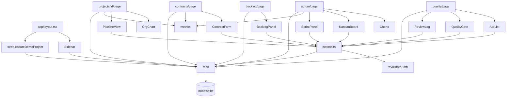

# CODE_SUMMARY (SOP-5) — smartit_console, end of Sprint 3

## Code Review All
### src/lib/db.ts
- Switched from better-sqlite3 to node:sqlite mid-sprint (native build failed in sandbox). Wrapper exposes prepare/run/get/all/exec/transaction. Statement cache per SQL string. OK.
### src/lib/repo.ts
- All Contract B `Repo` methods implemented. `setPhase` enforces one-active-phase invariant. `updateSprint(active)` enforces one-active-sprint. Row mappers coerce null → "" / null explicitly. OK.
### src/lib/metrics.ts
- Pure. `burndown` marks future days `NaN` (chart skips them). `consistencyGate` parses Logic Analysis rows as `<file> — <desc>` (also accepts `-`, `–`, `:`). OK.
### src/lib/actions.ts
- Every action validates via `str/int/oneOf`, then `revalidatePath(layout)`. No unvalidated enum reaches the DB. OK.
### src/lib/seed.ts
- Idempotent by project name. Backdates `done_at` directly via SQL for a realistic burndown. OK.
### src/components/KanbanBoard.tsx
- Optimistic local state + `useTransition`; resyncs when server props change (key comparison). Native DnD + select fallback. OK.
### src/components/PipelineView.tsx
- Client stepper; `readOnly` mode reused on /how-it-works. OK.
### src/components/{OrgChart,MessagePool,Charts}.tsx
- Pure SVG, server components. OK.
### src/app/**
- All routes async-await `params` (Next 15). `layout.tsx` is `force-dynamic` and seeds once. OK.

## Call Flow (actual)

Matches Contract B's planned sequence (Page → Actions → Repo → SQLite, Metrics pure) with one addition: `layout.tsx` calls `seed` (P2 requirement, planned in STRATEGY).

## Summary
- db.ts: sqlite wrapper · repo.ts: all data access · metrics.ts: pure calcs · pipeline.ts: the methodology · actions.ts: 24 server actions · seed.ts: demo · 13 components · 9 routes · 2 test files (21 tests).

## TODOs
{}

## Is-Pass
**YES** — nothing outstanding for v1 scope. Known gaps are disclosed in README, not hidden here.

---
# v2 addendum (Claude Bridge + enterprise UI)

## Code Review All
### src/lib/bridge.ts — commands (queue/claim/update), activity (seq-ordered feed), exportProject/importProject (upsert by id→name, de-dup, savepoint-safe). LGTM.
### src/lib/claude.ts — optional engine: repo snapshot (bounded), prompt from SOP layer, JSON parse, import. LGTM.
### src/app/api/bridge/** — 9 routes, shared guard/json helpers, optional bearer token. LGTM.
### src/lib/db.ts — nested transactions became SAVEPOINTs (bug found by bridge test: "cannot start a transaction within a transaction"). LGTM (pass 2).
### src/components/system.tsx — ToastProvider, ActionForm (confirm + toast + NEXT_REDIRECT passthrough), Modal, ThemeToggle, Icon set. LGTM.
### src/components/AppShell.tsx — sidebar, top bar, breadcrumbs, ⌘K palette. LGTM.
### src/components/ClaudePanel.tsx — polling feed (since-seq), composer, command rows, connection card. LGTM (pass 2: unknown→ReactNode typing).
### Theme — Tailwind palette remapped to CSS variables so v1 components re-themed without edits; SVG charts moved to fill-*/stroke-* classes. LGTM.

## TODOs
{}
## Is-Pass
YES — 24/24 tests, typecheck clean, build clean, live E2E both directions (NamastePOS imported from Cowork; app-typed command processed from Cowork).
