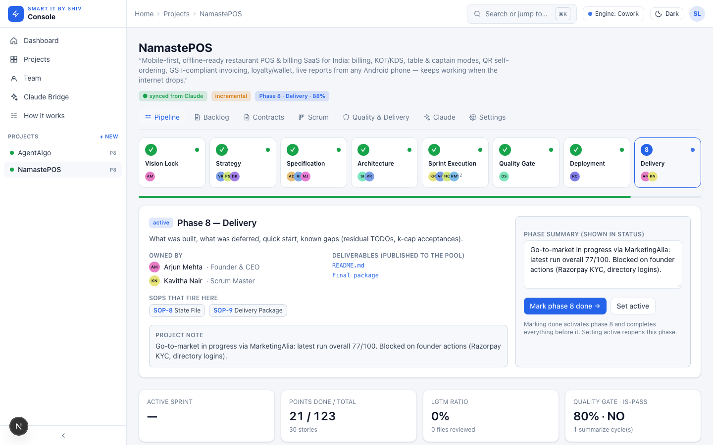
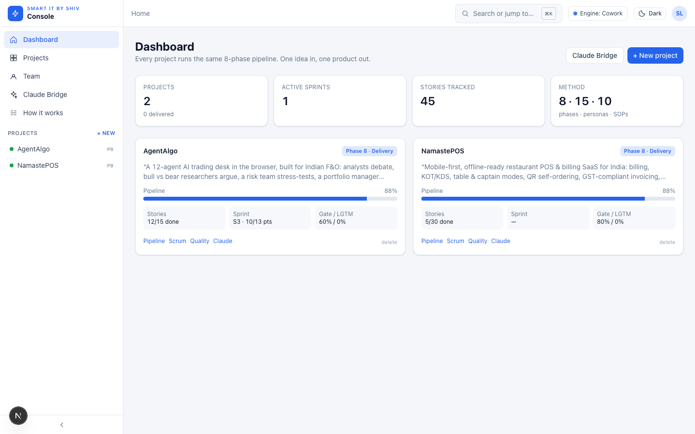
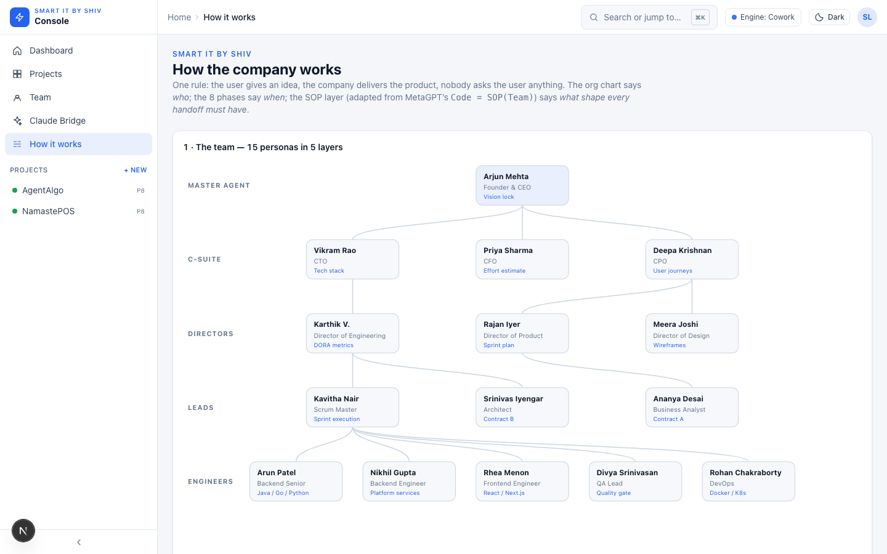
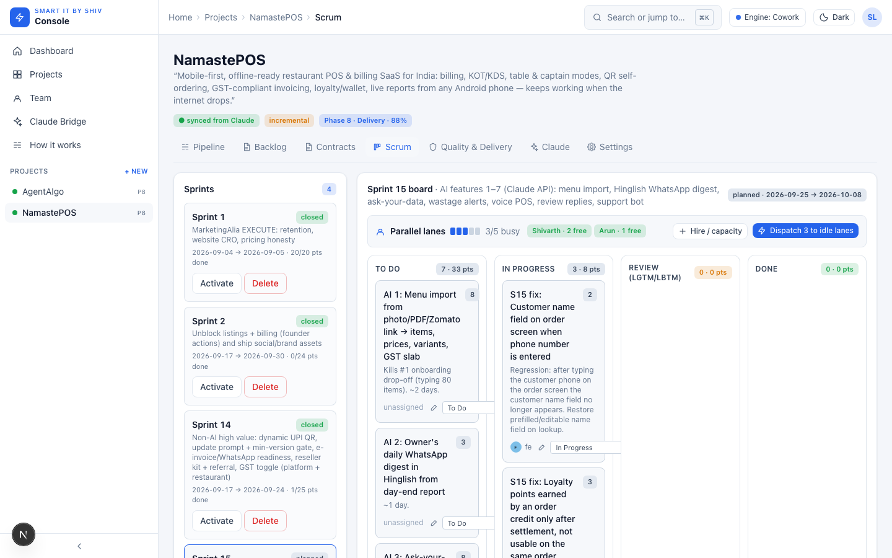
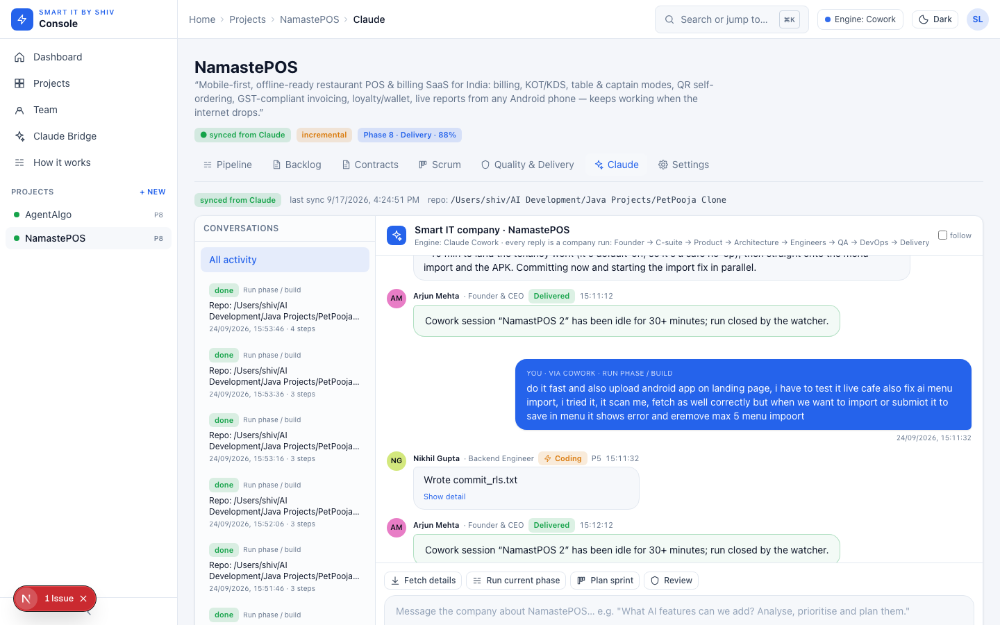
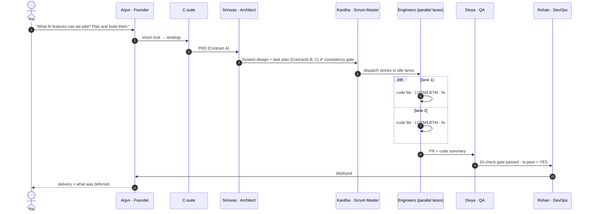
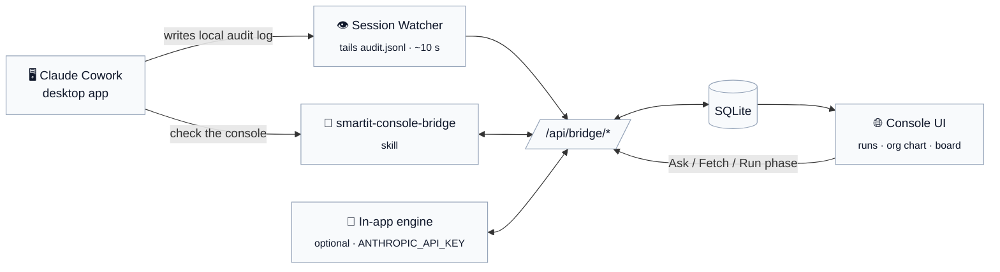

<div align="center">


# SmartIT Console

**Run an AI software company from your browser.**<br/>
One idea in → a CEO, a C‑suite, architects, engineers, QA and DevOps hand it down the line → a shipped product out. Watch every step live.

[](https://github.com/shivharilokhande/smartit-console/actions)
[](https://github.com/shivharilokhande/smartit-console/commits/main)
[](https://github.com/shivharilokhande/smartit-console/stargazers)
[](LICENSE)
<br/>


-003b57?logo=sqlite&logoColor=white)


[**Quick start**](#-quick-start) · [**How it works**](#-how-the-company-works) · [**Live company runs**](#-live-company-runs) · [**Claude Cowork bridge**](#-claude-cowork-bridge) · [**Modules**](#-whats-inside) · [**API**](#-bridge-api) · [**Docs**](#-documentation)



</div>

---

## ✨ What is this?

SmartIT Console is a self‑hosted **project · product · scrum management console** for software that is built by AI agents instead of (or alongside) humans. It is the visual front‑end of the **Smart IT by Shiv** methodology: an autonomous IT company with **8 phases**, **15 personas** (Founder → CTO/CFO/CPO → Directors → Leads → Engineers) and **10 SOPs** adapted from MetaGPT's `Code = SOP(Team)`.

Every project you add runs the same pipeline. Every request you make — a question, an analysis, a plan, code, tests, a deployment — becomes a **company run** that flows from the CEO down to the last engineer and back, and you can watch it happen on the org chart in real time.

> **Not a demo.** This console is running production work today: it manages NamastePOS (a restaurant POS SaaS, 30 stories, 15 sprints) and AgentAlgo (a 12‑agent trading desk) — both driven from Claude Cowork on the same machine.

<table>
<tr>
<td width="50%"></td>
<td width="50%"></td>
</tr>
<tr>
<td align="center"><sub><b>Dashboard</b> — every project, its phase, sprint, gate and LGTM ratio</sub></td>
<td align="center"><sub><b>How the company works</b> — the org chart lights up while personas work</sub></td>
</tr>
<tr>
<td width="50%"></td>
<td width="50%"></td>
</tr>
<tr>
<td align="center"><sub><b>Scrum</b> — sprints, drag‑and‑drop kanban, <i>parallel lanes</i>, hire capacity, dispatch idle lanes</sub></td>
<td align="center"><sub><b>Claude</b> — talk to the company; every reply is a persona‑attributed company run</sub></td>
</tr>
</table>

---

## 🚀 Quick start

```bash
git clone https://github.com/shivharilokhande/smartit-console.git
cd smartit-console
npm install                 # no native builds — SQLite comes from Node itself
npm run dev                 # → http://localhost:3100
```

<details>
<summary><b>Docker</b></summary>

```bash
docker compose up --build   # → http://localhost:3100 · data persists in the smartit-data volume
```
</details>

<details>
<summary><b>Run it forever on macOS (LaunchAgent)</b></summary>

The console is meant to sit next to Claude Cowork on your Mac. A LaunchAgent keeps it alive across logins:

```bash
cp docs/com.smartit.console.plist ~/Library/LaunchAgents/   # edit the path inside first
launchctl bootstrap gui/$(id -u) ~/Library/LaunchAgents/com.smartit.console.plist
launchctl kickstart -k gui/$(id -u)/com.smartit.console      # restart any time
```
</details>

A demo project is created on first run so every screen has data. Delete it from the dashboard when you're done — it won't come back (`SEED_DEMO=0` skips it entirely).

---

## 🏢 How the company works

```mermaid
flowchart LR
    classDef p fill:#eef2ff,stroke:#6366f1,color:#1e1b4b
    classDef g fill:#ecfdf5,stroke:#10b981,color:#064e3b
    I([💡 One-line idea]) --> P1
    subgraph Company["Smart IT by Shiv · 8 phases · 15 personas · 10 SOPs"]
      direction LR
      P1[1 · Vision Lock<br/><sub>Founder</sub>]:::p --> P2[2 · Strategy<br/><sub>CTO · CFO · CPO</sub>]:::p
      P2 --> P3[3 · Specification<br/><sub>BA · Dir. Product · Dir. Design</sub><br/><b>Contract A · PRD</b>]:::p
      P3 --> P4[4 · Architecture<br/><sub>Architect · Dir. Eng</sub><br/><b>Contracts B + C</b>]:::p
      P4 --> P5[5 · Sprint Execution<br/><sub>Scrum Master · Engineers</sub>]:::p
      P5 --> P6[6 · Quality Gate<br/><sub>QA Lead</sub><br/><b>10 checks</b>]:::g
      P6 --> P7[7 · Deployment<br/><sub>DevOps</sub>]:::p
      P7 --> P8[8 · Delivery<br/><sub>Founder · Scrum Master</sub>]:::p
    end
    P8 --> O([📦 Shipped product + delivery package])
```



**The org chart says *who*, the phases say *when*, the SOPs say *what shape every hand‑off must have.***

<details>
<summary><b>The 15 personas</b></summary>

| Layer | Persona | Owns |
|---|---|---|
| Master agent | **Arjun Mehta** · Founder & CEO | Vision lock, final delivery |
| C‑suite | **Vikram Rao** · CTO | Tech stack, ADRs |
| | **Priya Sharma** · CFO | Effort estimate, abort threshold |
| | **Deepa Krishnan** · CPO | User journeys |
| Directors | **Karthik V.** · Director of Engineering | DORA metrics, coding standards |
| | **Rajan Iyer** · Director of Product | Sprint plan, backlog |
| | **Meera Joshi** · Director of Design | Wireframes, UI draft |
| Leads | **Kavitha Nair** · Scrum Master | Sprint execution, dispatch |
| | **Srinivas Iyengar** · Architect | Contract B (system design) |
| | **Ananya Desai** · Business Analyst | Contract A (PRD) |
| Engineers | **Arun Patel** · Backend Senior | Java / Go / Python |
| | **Nikhil Gupta** · Backend Engineer | Platform services |
| | **Rhea Menon** · Frontend Engineer | React / Next.js |
| | **Divya Srinivasan** · QA Lead | 10‑check quality gate |
| | **Rohan Chakraborty** · DevOps | Docker / K8s / CI |

Need more hands? **Team → Hire** adds engineers with their own capacity; the scrum board then runs more lanes in parallel.
</details>

<details>
<summary><b>The 10 SOPs (MetaGPT‑derived)</b></summary>

| SOP | Name | What it enforces |
|---|---|---|
| SOP‑1 | Consistency gate | `File List == Logic Analysis == Task List` before any code is written |
| SOP‑2 | Structured contracts | Contract A (PRD), B (System Design), C (Task Plan) as typed fields, not prose |
| SOP‑3 | Message pool | Every deliverable is *published*; every persona *subscribes* — no side channels |
| SOP‑4 | Per‑file review | Each file gets **LGTM / LBTM**, k = 2 passes max, before it is accepted |
| SOP‑5 | Code summary & is‑pass | Executable feedback: tests run, summary written, `is-pass` YES/NO |
| SOP‑6 | One‑file coding | One engineer, one file, one commit — no sprawling diffs |
| SOP‑7 | Incremental mode | Existing repos get *Code Plan & Change* from git‑diff, not a rewrite |
| SOP‑8 | State file | Phase status is data, persisted, resumable |
| SOP‑9 | Delivery package | VISION → STRATEGY → SPEC → ARCH → TASK_PLAN → CODE_SUMMARY → QUALITY_REPORT |
| SOP‑10 | Abort threshold | CFO sets the sprint cap; the company stops instead of drifting |
</details>

---

## 🔴 Live company runs

Ask the company anything — from the console's Claude tab **or** from Claude Cowork on the same Mac — and a **company run** starts. Each step is attributed to a persona, a phase and a kind of work (`think · analyze · decide · write · design · code · review · test · deploy · deliver`), with expandable detail: reasoning, code, test output.



Where you see it:

- **Pipeline tab → Live now** — who is working right now, on what, at which phase; the same persona glows on the org chart with a loading ring.
- **Company run page** (`/projects/:id/runs/:commandId`) — phase rail + timeline grouped by phase and persona, live while running, Founder's delivery at the end.
- **Claude tab** — a Cowork‑style chat where every reply is a full company run.

---

## 🔗 Claude Cowork bridge

The console and Claude Cowork are linked **both ways** — no API key required.



| Direction | How |
|---|---|
| **Cowork → Console** | The built‑in **Session Watcher** tails Cowork's local session logs, fuzzy‑matches sessions to projects (`"NamastPOS 2"` → *NamastePOS*), and mirrors every assistant message, file write, command, test run and sub‑agent into the project's live run — classified to a persona/phase/step by content. Idle sessions close their run after 30 min. |
| **Console → Cowork** | Type in the Claude tab (*Fetch details*, *Run phase*, *Plan sprint*, *Review files*, *Dispatch*, or free text). Commands queue; in Cowork say **"check the console"** (or let the `smartit-console-sync` scheduled task poll every 5 min) and Claude claims the queue, works with the Smart IT SOPs and streams progress back. |
| **Standalone** | Set `ANTHROPIC_API_KEY` and the console processes its own queue: one Claude call per phase, personas' steps streamed live. |

---

## 🧭 What's inside

| Module | What you do there |
|---|---|
| **Dashboard** | All projects at a glance: phase progress, active sprint, gate %, LGTM %. Create, open, delete. |
| **How it works** | The interactive org chart, the 8‑phase stepper, the SOP message‑pool diagram, the per‑file coding loop, the 10 quality checks. |
| **Team** | The roster with capacity per persona. **Hire** engineers to add parallel lanes; deactivate or remove them later. |
| **Project → Pipeline** | This project's 8 phases: owners, deliverables, SOPs per phase, mark done / reopen, and the *Live now* strip. |
| **Project → Backlog** | Requirement pool (P0/P1/P2) → product backlog of user stories → plan into sprints. |
| **Project → Contracts** | Contract A (PRD), B (System Design), C (Task Plan) as structured forms with the SOP‑1 consistency gate. |
| **Project → Scrum** | Sprints, drag‑and‑drop kanban (To Do / In Progress / Review / Done), story points, burndown, velocity, **parallel lanes** and **Dispatch to idle lanes**. |
| **Project → Quality & Delivery** | Per‑file LGTM/LBTM log, code summary / is‑pass, 10‑check quality gate, ADRs, deployment status. |
| **Project → Claude** | Chat with the company. Conversation list on the left, persona‑attributed run on the right. |
| **Claude Bridge** | Global view: command queue, live activity across all projects, bridge health. |

Plus: light/dark theme, collapsible sidebar, breadcrumbs, **⌘K** command palette, toasts on every action, confirm dialogs on every delete, inline editing everywhere.

---

## 🔌 Bridge API

Everything the UI does, a script or an agent can do too.

| Endpoint | Method | Purpose |
|---|---|---|
| `/api/bridge/health` | GET | Liveness + version |
| `/api/bridge/projects` | GET | All projects (summary) |
| `/api/bridge/projects/:id` | GET | Full project bundle (phases, stories, sprints, contracts, reviews, gate, ADRs) |
| `/api/bridge/import` | POST | Upsert a `ProjectBundle` (by id → by name; de‑duplicated; `replace` flag) |
| `/api/bridge/commands` | GET / POST | List or enqueue commands |
| `/api/bridge/commands/:id` | GET / PATCH | Claim, progress, finish a command |
| `/api/bridge/activity` | GET / POST | Live feed (filter by project / command / `sinceSeq`) |
| `/api/bridge/team` | GET | Roster, capacity, lanes |
| `/api/bridge/snapshot` | GET | Repo snapshot for a project (`repo_path`) |
| `/api/bridge/tick` | POST | Run one engine / watcher cycle now |

Set `BRIDGE_TOKEN` to require `Authorization: Bearer <token>`. `data/run-ai-features.sh` is a scripted example run you can replay against a fresh install.

---

## ⚙️ Configuration

| Variable | Default | Meaning |
|---|---|---|
| `PORT` | `3100` | HTTP port |
| `DATA_DIR` | `./data` | Where `smartit.db` lives (`:memory:` in tests) |
| `SEED_DEMO` | `1` | Create the demo project on first run (once per database) |
| `COWORK_WATCHER` | `1` | Tail Claude Cowork session logs |
| `COWORK_SESSIONS_DIR` | `~/Library/Application Support/Claude/local-agent-mode-sessions` | Where those logs are |
| `COWORK_WATCH_INTERVAL_MS` | `10000` | Watcher poll interval |
| `ANTHROPIC_API_KEY` | — | Enables the in‑app engine |
| `CLAUDE_MODEL` | `claude-sonnet-5` | Model for the in‑app engine |
| `BRIDGE_TOKEN` | — | Protect the bridge API |

---

## 🏗️ Architecture

```
src/
├─ app/            Next.js 15 App Router · Server Components · /api/bridge/* routes
├─ components/     AppShell · PipelineView · OrgChart (live) · RunView · ChatPanel · KanbanBoard · Charts (hand-rolled SVG)
└─ lib/
   ├─ pipeline.ts  The methodology as data: PERSONAS · PHASES · SOPS · CONTRACTS · GATE
   ├─ db.ts        node:sqlite wrapper · savepoint-nested transactions · additive migrations
   ├─ repo.ts      All SQL, typed
   ├─ actions.ts   Server Actions (every mutation)
   ├─ bridge.ts    Command queue · activity feed · ProjectBundle import/export
   ├─ cowork.ts    Session Watcher · fuzzy project match · persona classifier
   ├─ claude.ts    Optional in-app engine (one Claude call per phase)
   ├─ team.ts      Roster · capacity · lanes
   └─ dispatch.ts  Assign stories to idle lanes
tests/unit/        Vitest · 28 tests
```

Design principles: **methodology is data** (change the company without touching UI), **zero native dependencies** (`node:sqlite`, no build step), **local‑first** (your projects never leave your machine unless you add an API key), **everything is a command** (UI, Cowork and API all enqueue the same thing).

```bash
npm run typecheck   # tsc --noEmit
npm test            # vitest
npm run build       # standalone output, used by the Dockerfile
```

---

## 📚 Documentation

This repository was itself built by the Smart IT company, so it ships its own delivery package:

[VISION](VISION.md) · [STRATEGY](STRATEGY.md) · [SPECIFICATION — Contract A](SPECIFICATION.md) · [ARCHITECTURE — Contract B](ARCHITECTURE.md) · [TASK_PLAN — Contract C](TASK_PLAN.md) · [CODE_SUMMARY](CODE_SUMMARY.md) · [QUALITY_REPORT](QUALITY_REPORT.md) · [SPRINT_REPORT](SPRINT_REPORT.md) · [DEPLOYMENT](DEPLOYMENT.md) · [ADRs](docs/adrs)

---

## 🗺️ Roadmap

- [x] 8‑phase pipeline, 15 personas, 10 SOPs, 10‑check quality gate
- [x] Scrum: sprints, kanban, burndown, velocity, parallel lanes, hiring, dispatch
- [x] Two‑way Claude Cowork bridge (Session Watcher + skill + scheduled task)
- [x] Live company runs with org‑chart highlighting
- [x] Optional in‑app engine via the Claude API
- [ ] In‑app Mermaid rendering for Contracts B/C diagrams
- [ ] Repo import → auto‑fill Contract B *File List*
- [ ] Export a project as its Smart IT delivery package (zip)
- [ ] Multi‑user with roles
- [ ] Playwright E2E in CI

## 🤝 Contributing

Issues and PRs are welcome. Run `npm run typecheck && npm test` before opening a PR; every file in a PR gets the same LGTM/LBTM review the company gives its own code.

## 📄 License

[MIT](LICENSE) © 2026 Shivhari Lokhande

<div align="center">
<sub>Built with the <b>Smart IT by Shiv</b> skill for Claude · inspired by <a href="https://github.com/FoundationAgents/MetaGPT">MetaGPT</a>'s <code>Code = SOP(Team)</code></sub>
</div>
