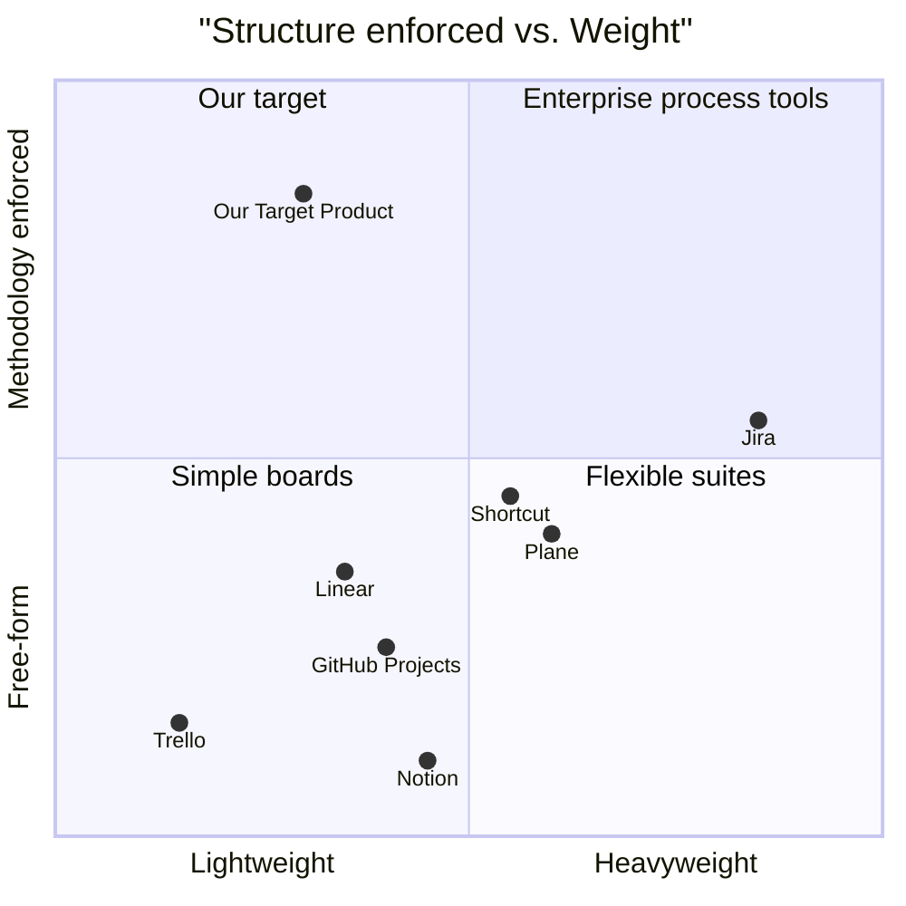

# SPECIFICATION — Contract A (PRD)

| Field | Value |
|---|---|
| Language | en_us |
| Programming Language | TypeScript — Next.js 15, React 19, Tailwind 3, node:sqlite |
| Original Requirements | "I want visual of how this work and a complete project, product and scrum management tool and i can use it in each project — build a webapp for this." |
| Project Name | smartit_console |
| Product Goals | 1) Make the Smart IT pipeline visible and trackable per project. 2) Replace ad-hoc notes with structured Contracts A/B/C and a real scrum board. 3) Give one honest quality/delivery picture (LGTM ratio, is-pass, gate score) per project. |
| User Stories | US-1 As the founder, I want to create a project from a one-line idea so every build starts the same way. US-2 As the founder, I want to see which phase each project is in and advance it. US-3 As a product owner, I want to manage a P0/P1/P2 requirement pool and user stories, and fill Contracts A/B/C with a gate that tells me when they're inconsistent. US-4 As a scrum master, I want sprints, a drag-and-drop kanban, points, velocity and burndown. US-5 As QA, I want to log per-file LGTM/LBTM verdicts, run the 10-check gate, record ADRs and deployment status. |
| Competitive Analysis | Jira: powerful, heavy, no pipeline concept. Linear: fast, beautiful, no contracts/quality gate. Trello: simple kanban, no sprints/points natively. Notion: flexible, zero structure enforcement. Shortcut: good sprints, no SOP/architecture artifacts. GitHub Projects: close to code, weak product docs. Plane (OSS): self-hostable Jira-alike, no methodology built in. |
| Competitive Quadrant Chart | see below |
| Requirement Analysis | Hard parts: (a) keeping the pipeline model data-driven so the visual and the project status share one source of truth (`pipeline.ts`); (b) drag-and-drop kanban without a heavy DnD library (native HTML5 DnD + server action); (c) consistency gate logic across three JSON contracts; (d) burndown needs done-timestamps per story. Scope risk: contract forms — keep them as key/value + textarea fields, not rich editors. |
| Requirement Pool | P0 projects+phases · P0 pipeline visualizer · P0 backlog+contracts+gate · P0 sprints+kanban+points · P0 velocity+burndown · P0 review log+quality gate+ADRs+deploy · P1 how-it-works company visual · P2 demo seed project |
| UI Design Draft | Left sidebar (Projects, How it works). Project view has tabs: Pipeline · Backlog · Contracts · Scrum · Quality. Pipeline tab = horizontal 8-step stepper with persona avatars and SOP badges; clicking a phase opens its detail + "mark complete". Scrum tab = sprint selector + 4-column kanban + two small SVG charts. Quality tab = review log table, gate checklist, ADR list, deploy card. Dark, dense, dashboard-like. |
| Anything UNCLEAR | Q: multi-user? → user said single-user; no auth. Q: hosting? → self-host via Docker. Q: should the app *run* the AI pipeline? → No; it tracks and visualizes it (v2 candidate). |

## USER_STORIES (seed for sprints)
| ID | Story | Pts | Sprint |
|---|---|---|---|
| S1.1 | Scaffold app, DB, schema, repo layer | 5 | 1 |
| S1.2 | Projects CRUD + dashboard | 5 | 1 |
| S1.3 | Pipeline definition + visualizer with phase status | 8 | 1 |
| S1.4 | How-it-works company visual | 5 | 1 |
| S2.1 | Backlog: requirement pool + user stories | 5 | 2 |
| S2.2 | Contracts A/B/C forms + consistency gate | 8 | 2 |
| S2.3 | Sprints + kanban DnD + points | 8 | 2 |
| S2.4 | Velocity + burndown SVG | 3 | 2 |
| S3.1 | Review log LGTM/LBTM + code summary is-pass | 5 | 3 |
| S3.2 | Quality gate 10 checks + ADRs + deployment card | 5 | 3 |
| S3.3 | Tests (metrics, repo) | 5 | 3 |
| S3.4 | Docker, CI, docs | 5 | 3 |
